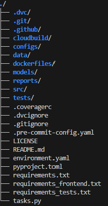
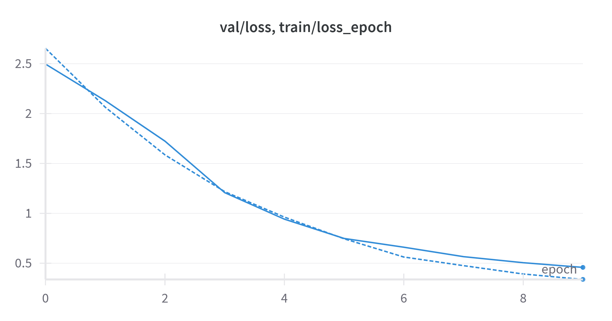
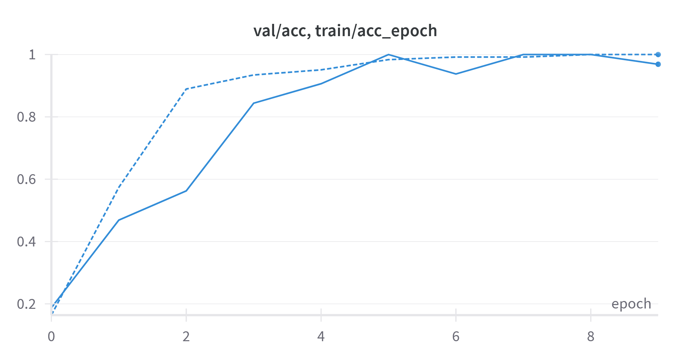
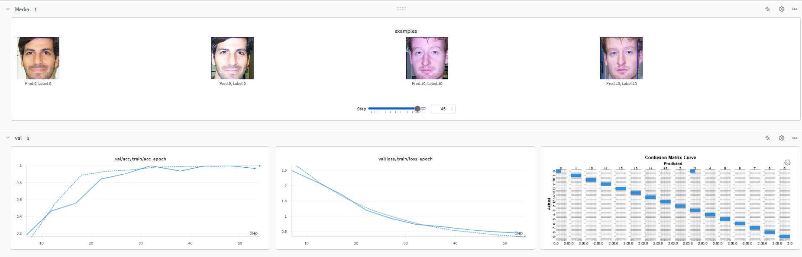
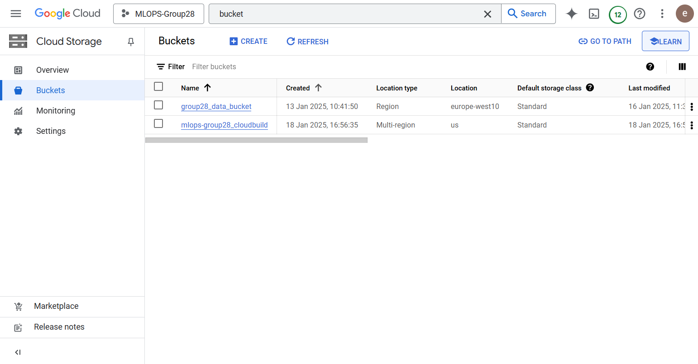
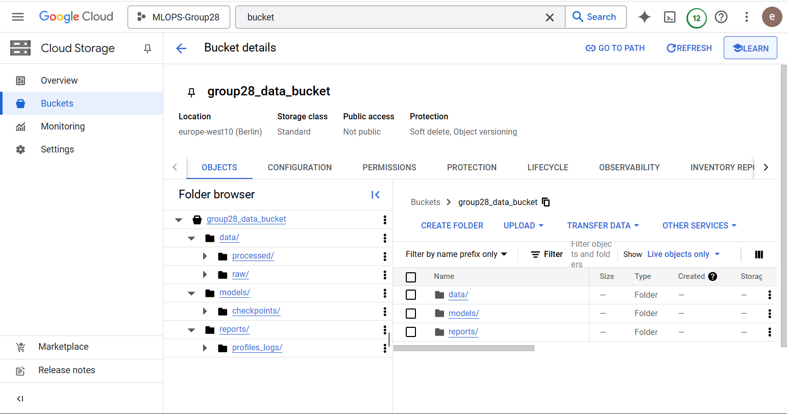
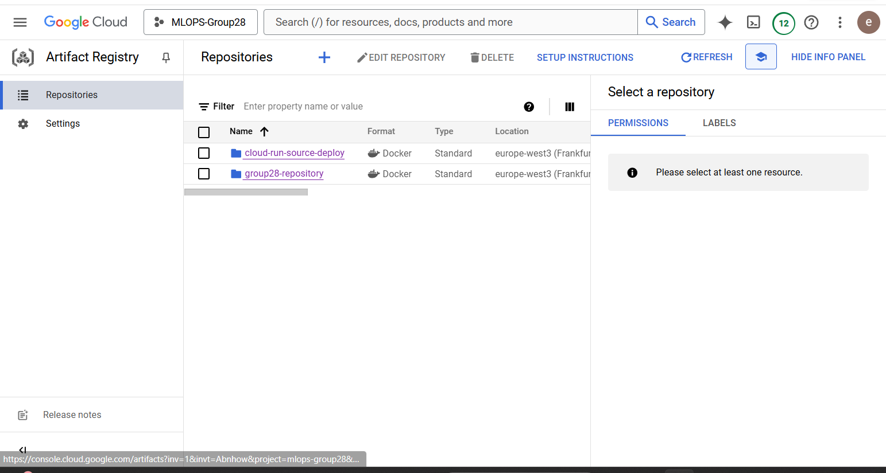
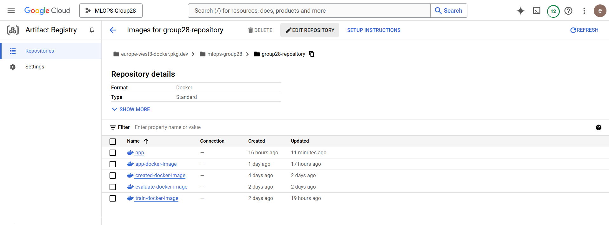
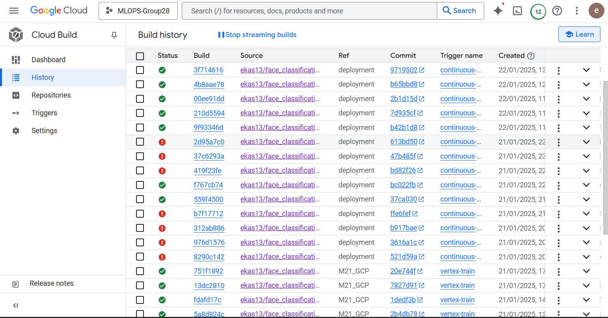
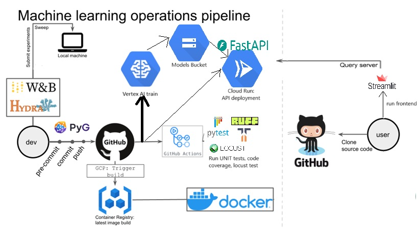

# Exam template for 02476 Machine Learning Operations

This is the report template for the exam. Please only remove the text formatted as with three dashes in front and behind
like:

```--- question 1 fill here ---```

Where you instead should add your answers. Any other changes may have unwanted consequences when your report is
auto-generated at the end of the course. For questions where you are asked to include images, start by adding the image
to the `figures` subfolder (please only use `.png`, `.jpg` or `.jpeg`) and then add the following code in your answer:

```markdown

```

In addition to this markdown file, we also provide the `report.py` script that provides two utility functions:

Running:

```bash
python report.py html
```

Will generate a `.html` page of your report. After the deadline for answering this template, we will auto-scrape
everything in this `reports` folder and then use this utility to generate a `.html` page that will be your serve
as your final hand-in.

Running

```bash
python report.py check
```

Will check your answers in this template against the constraints listed for each question e.g. is your answer too
short, too long, or have you included an image when asked. For both functions to work you mustn't rename anything.
The script has two dependencies that can be installed with

```bash
pip install typer markdown
```

## Overall project checklist

The checklist is *exhaustive* which means that it includes everything that you could do on the project included in the
curriculum in this course. Therefore, we do not expect at all that you have checked all boxes at the end of the project.
The parenthesis at the end indicates what module the bullet point is related to. Please be honest in your answers, we
will check the repositories and the code to verify your answers.

### Week 1

* [X] Create a git repository (M5)
* [X] Make sure that all team members have write access to the GitHub repository (M5)
* [X] Create a dedicated environment for you project to keep track of your packages (M2)
* [X] Create the initial file structure using cookiecutter with an appropriate template (M6)
* [X] Fill out the `data.py` file such that it downloads whatever data you need and preprocesses it (if necessary) (M6)
* [X] Add a model to `model.py` and a training procedure to `train.py` and get that running (M6)
* [X] Remember to fill out the `requirements.txt` and `requirements_dev.txt` file with whatever dependencies that you
    are using (M2+M6)
* [X] Remember to comply with good coding practices (`pep8`) while doing the project (M7)
* [X] Do a bit of code typing and remember to document essential parts of your code (M7)
* [X] Setup version control for your data or part of your data (M8)
* [X] Add command line interfaces and project commands to your code where it makes sense (M9)
* [X] Construct one or multiple docker files for your code (M10)
* [X] Build the docker files locally and make sure they work as intended (M10)
* [X] Write one or multiple configurations files for your experiments (M11)
* [X] Used Hydra to load the configurations and manage your hyperparameters (M11)
* [X] Use profiling to optimize your code (M12)
* [X] Use logging to log important events in your code (M14)
* [X] Use Weights & Biases to log training progress and other important metrics/artifacts in your code (M14)
* [X] Consider running a hyperparameter optimization sweep (M14)
* [X] Use PyTorch-lightning (if applicable) to reduce the amount of boilerplate in your code (M15)

### Week 2

* [X] Write unit tests related to the data part of your code (M16)
* [X] Write unit tests related to model construction and or model training (M16)
* [X] Calculate the code coverage (M16)
* [X] Get some continuous integration running on the GitHub repository (M17)
* [X] Add caching and multi-os/python/pytorch testing to your continuous integration (M17)
* [X] Add a linting step to your continuous integration (M17)
* [X] Add pre-commit hooks to your version control setup (M18)
* [X] Add a continues workflow that triggers when data changes (M19)
* [X] Add a continues workflow that triggers when changes to the model registry is made (M19)
* [X] Create a data storage in GCP Bucket for your data and link this with your data version control setup (M21)
* [X] Create a trigger workflow for automatically building your docker images (M21)
* [X] Get your model training in GCP using either the Engine or Vertex AI (M21)
* [X] Create a FastAPI application that can do inference using your model (M22)
* [X] Deploy your model in GCP using either Functions or Run as the backend (M23)
* [X] Write API tests for your application and setup continues integration for these (M24)
* [X] Load test your application (M24)
* [X] Create a more specialized ML-deployment API using either ONNX or BentoML, or both (M25)
* [X] Create a frontend for your API (M26)

### Week 3

* [ ] Check how robust your model is towards data drifting (M27)
* [ ] Deploy to the cloud a drift detection API (M27)
* [X] Instrument your API with a couple of system metrics (M28)
* [X] Setup cloud monitoring of your instrumented application (M28)
* [X] Create one or more alert systems in GCP to alert you if your app is not behaving correctly (M28)
* [ ] If applicable, optimize the performance of your data loading using distributed data loading (M29)
* [ ] If applicable, optimize the performance of your training pipeline by using distributed training (M30)
* [ ] Play around with quantization, compilation and pruning for you trained models to increase inference speed (M31)

### Extra

* [ ] Write some documentation for your application (M32)
* [ ] Publish the documentation to GitHub Pages (M32)
* [X] Revisit your initial project description. Did the project turn out as you wanted?
* [X] Create an architectural diagram over your MLOps pipeline
* [X] Make sure all group members have an understanding about all parts of the project
* [X] Uploaded all your code to GitHub

## Group information

### Question 1
> **Enter the group number you signed up on <learn.inside.dtu.dk>**
>
> Answer:

GROUP 28
>
### Question 2
> **Enter the study number for each member in the group**
>
> Example:
>
> *sXXXXXX, sXXXXXX, sXXXXXX*
>
> Answer:

s232469, s233025, s243169, s232458, s233576

### Question 3
> **A requirement to the project is that you include a third-party package not covered in the course. What framework**
> **did you choose to work with and did it help you complete the project?**
>
> Recommended answer length: 100-200 words.
>
> Example:
> *We used the third-party framework ... in our project. We used functionality ... and functionality ... from the*
> *package to do ... and ... in our project*.
>
> Answer:

We chose to fine-tune a pre-trained ResNet34 model from the [torchvision library](https://pytorch.org/vision/main/models/generated/torchvision.models.resnet34.html). The ResNet34 model was originally trained on the ImageNet1k dataset, which consists of 1.2 million labeled images across 1,000 classes. This pretraining provides a strong foundation for transfer learning, especially for tasks with limited data like ours.

Why ResNet34?
- Residual Connections: ResNet34 utilizes residual blocks, which help mitigate the vanishing gradient problem and enable deeper networks to learn effectively.
- Pretraining Benefits: The model’s pretrained weights on ImageNet1k allow it to extract generic image features that are transferable to our face recognition task.
- Efficiency: ResNet34 strikes a balance between performance and computational efficiency, making it suitable for deployment on limited hardware resources.

## Coding environment

> In the following section we are interested in learning more about you local development environment. This includes
> how you managed dependencies, the structure of your code and how you managed code quality.

### Question 4

> **Explain how you managed dependencies in your project? Explain the process a new team member would have to go**
> **through to get an exact copy of your environment.**
>
> Recommended answer length: 100-200 words
>
> Example:
> *We used ... for managing our dependencies. The list of dependencies was auto-generated using ... . To get a*
> *complete copy of our development environment, one would have to run the following commands*
>
> Answer:
Note that in order to be able to run the project locally, integration with Weights & Biases (wandb) and Google cloud is necessary, since the data is accessed from Google Cloud via dvc and logging takes place via wandb. 
We used conda environment with Python 3.11 for managing our dependecies.  The list of dependencies was auto generated using pipreqs.
To get a obtain a copy of our environment, one would have to run the following commands:
```bash
# Clone the repository
git https://github.com/ekas13/face_classification.git
cd face_classification

# Create a conda environment with Python 3.11
pip install invoke==2.2.0 dvc==3.58.0
invoke create-environment
invoke requirements

# We use the project in developer mode
pip install -e .

# Set up your wandb account on https://wandb.ai/, then log in here:
wandb login

# Set up your google cloud account depending on what platform you are using: https://cloud.google.com/sdk/docs/install. Next, contact us to get access to our project on Google Cloud, so that you can access the data and the services. Then log in here:
gcloud auth application-default login

# Pull the data
dvc pull --no-run-cache

# Verify that environment is set up correctly
pytest tests
```

### Question 5

> **We expect that you initialized your project using the cookiecutter template. Explain the overall structure of your**
> **code. What did you fill out? Did you deviate from the template in some way?**
>
> Recommended answer length: 100-200 words
>
> Example:
> *From the cookiecutter template we have filled out the ... , ... and ... folder. We have removed the ... folder*
> *because we did not use any ... in our project. We have added an ... folder that contains ... for running our*
> *experiments.*
>
> Answer:
From the cookiecutter template we have filled out the following folders and files:
- `.github/`: GitHub-specific files, including workflows and actions.
- `configs/`: Configuration files for experiments and training.
- `data/`: Directory for the dataset in raw and processed format.
- `dockerfiles/`: Dockerfile definitions for building container images.
- `models/`: Directory for storing trained models and checkpoints.
- `reports/`: Generated reports and related files.
- `src/`: Source code for the project.
- `tests/`: Unit tests and test-related files.
- `wandb/`: Weights & Biases logs and configuration files.
- `./.gitignore`: Specifies files and directories for Git to ignore.
- `./LICENSE`: Contains the licensing information for the project.
- `./pyproject.toml`: Configuration file for Python project tools.
- `./tasks.py`: Contains automation tasks for the project.
- `./requirements.txt`: Lists main project dependencies.
- `./.pre-commit-config.yaml`: Configuration for pre-commit hooks.
- `./.env`: Environment variables for the project.

We have removed the following folders and files:
- `docs/`: This Readme file serves the purpose of documentation instead.
- `notebooks/`: We have used Python scripts for our project, because they are better aligned with the course's learning objectives.
- `./requirements_dev.txt`: Lists development dependencies. All our dependencies were included in the other requirement files, so there was not any need to use this file.

We have added the following folders and files:
- `cloudbuild/`: Configuration files for Google Cloud Build.
- `./.dvcignore`: Specifies files and directories for DVC to ignore.
- `./environment.yaml`: Defines the conda environment and its dependencies.
- `./requirements_tests.txt`: Lists dependencies required for running tests.
- `./requirements_frontend.txt`: Lists dependencies required for the frontend.
- `./.coveragerc`: Configuration file for measuring code coverage.
- `./.vscode`: It contains the debug configuration.

The overall structure of our repository can be seen here:




### Question 6

> **Did you implement any rules for code quality and format? What about typing and documentation? Additionally,**
> **explain with your own words why these concepts matters in larger projects.**
>
> Recommended answer length: 100-200 words.
>
> Example:
> *We used ... for linting and ... for formatting. We also used ... for typing and ... for documentation. These*
> *concepts are important in larger projects because ... . For example, typing ...*
>
> Answer:

Yes, we implemented several rules and tools to ensure **code quality, formatting, typing, and documentation** in our project.

- **Linting & Formatting:**
  We used **Ruff** for **linting and enforcing style guidelines**. The configuration in our `pyproject.toml` file includes:
  ```toml
  [tool.ruff]
  line-length = 120
  [tool.ruff.lint]
  select = ["I", "D101"]

- **I** ensures imports are properly formatted.
- **D101** enforces docstring conventions - to be more exact it forces us to docstring explain every defined class in detail in our project

- **Typing**
    While Python is dynamically typed, using **type hints** (for return types and function arguments) improves readability and prevents errors.
    We ensured that function signatures followed **PEP 484** typing conventions.

- **Documentation**
    We maintained a **`README.md`** file for an overview of the project.

Why each of these matter:
Linting & Formatting ensure consistency and more importantly make collaboration and version control easier (i.e. remove unnecessray conflicts on git). Typing helps catch errors early and improves readability in the code. Documentation makes it easier for new developers and colleagues to understand parts of the project they didn't work on but still need to understand or allter.


## Version control

> In the following section we are interested in how version control was used in your project during development to
> corporate and increase the quality of your code.

### Question 7

> **How many tests did you implement and what are they testing in your code?**
>
> Recommended answer length: 50-100 words.
>
> Example:
> *In total we have implemented X tests. Primarily we are testing ... and ... as these the most critical parts of our*
> *application but also ... .*
>
> Answer:

We have implemented in total 9 UNIT tests which test our model and the training process alongside sanity checks for our data. There are also 2 integration tests for the API which test the root endpoint and the classify endpoint which is the main one used for classifying uploaded images. Finally, we have 1 performance test on the API via Locust which is only run after a merge to the main branch.

### Question 8

> **What is the total code coverage (in percentage) of your code? If your code had a code coverage of 100% (or close**
> **to), would you still trust it to be error free? Explain you reasoning.**
>
> Recommended answer length: 100-200 words.
>
> Example:
> *The total code coverage of code is X%, which includes all our source code. We are far from 100% coverage of our **
> *code and even if we were then...*
>
> Answer:

The total code coverage we ended up with was 38%, which includes all of our source python files. It is not close to 100% but testing other stuff to get it to 100% would have been pointless. For example we did not test the preprocess data function in our data.py because we ran it only once and it is not ran in production. If our code had 100% coverage we would not necessarily trust it to be error free, it depends on how that coverage was accomplished. You could cheat to 100% coverage by testing every line of the code without any actual meaningful tests.

### Question 9

> **Did you workflow include using branches and pull requests? If yes, explain how. If not, explain how branches and**
> **pull request can help improve version control.**
>
> Recommended answer length: 100-200 words.
>
> Example:
> *We made use of both branches and PRs in our project. In our group, each member had an branch that they worked on in*
> *addition to the main branch. To merge code we ...*
>
> Answer:

We made use of both branches and PRs in our project. Each member created a branch for a specific task or group of related tasks they were working on and occasionally for any fixes related to previously merged code. To merge code into the main branch, we used PRs, each of which required approval from at least one other team member. Before approving, we made sure no conflicts existed, and if there were any, we would merge the main branch into the working branch to resolve them. Once no conflicts existed, we would approve the PR and merge the code into the main branch. This process helped ensure code quality and better collaboration within the team.

### Question 10

> **Did you use DVC for managing data in your project? If yes, then how did it improve your project to have version**
> **control of your data. If no, explain a case where it would be beneficial to have version control of your data.**
>
> Recommended answer length: 100-200 words.
>
> Example:
> *We did make use of DVC in the following way: ... . In the end it helped us in ... for controlling ... part of our*
> *pipeline*
>
> Answer:

We did make use of **DVC (Data Version Control)** in our project to manage and access data stored on **Google Cloud Storage (GCS)**.
By integrating DVC, we were able to version control our data, ensuring that different experiments used the correct dataset versions. It also simplified data access, allowing our team to easily pull data from Google Cloud Storage, whic made collaboration and data sharing across team members efficient. Furthermore and most importantly, it later streamlined the deployment process and implementation of CICD, by ensuring that our machine learning pipeline had easy access to the data and used the exact version of it.

### Question 11

> **Discuss you continuous integration setup. What kind of continuous integration are you running (unittesting,**
> **linting, etc.)? Do you test multiple operating systems, Python  version etc. Do you make use of caching? Feel free**
> **to insert a link to one of your GitHub actions workflow.**
>
> Recommended answer length: 200-300 words.
>
> Example:
> *We have organized our continuous integration into 3 separate files: one for doing ..., one for running ... testing*
> *and one for running ... . In particular for our ..., we used ... .An example of a triggered workflow can be seen*
> *here: <weblink>*
>
> Answer:

For continuous integration, we use three workflows to handle code formatting, pre-commit checks and unit tests.
- **Unit tests**: This workflow runs tests on multiple operating systems (*ubuntu-latest*, *windows-latest*, *macos-latest*), Python versions (*3.10*, *3.11*, *3.12*) and with different versions of PyTorch (*2.4.0*, *2.5.0*, *2.5.1*). It caches pip dependencies using actions/cache to speed up subsequent runs. In addition, it pulls data from Google Cloud Platform using DVC and runs tests with coverage, ensuring that our code is properly tested across various configurations.
- **Code formatting**: We use ruff for code formatting and linting, ensuring consistent style across the project. This check is triggered on every push or pull request to the main branch.
- **Pre-commit**: Using pre-commit, we check for issues that can be automatically fixed before committing changes, such as removing trailing whitespaces and fixing end-of-file newlines. This process is triggered on push and pull request events to the main, helping automate and enforce code quality checks.

Additionally, we integrated a continuous machine learning (CML) workflow for data checking.

- **DVC workflow**: To ensure the integrity of our data, this workflow is triggered by DVC file changes on pull requests to main. It pulls the latest data from GCP and and generates a data statistics report, which is posted as a comment on the pull request.

These CI and CML workflows help ensuring consistent quality, automated checks and an efficient process. They make it easier to catch issues early on, preventing problems from reaching the main branch, and simplify machine learning pipeline integration.

The workflows can be found [here](.github/workflows).


## Running code and tracking experiments

> In the following section we are interested in learning more about the experimental setup for running your code and
> especially the reproducibility of your experiments.

### Question 12

> **How did you configure experiments? Did you make use of config files? Explain with coding examples of how you would**
> **run a experiment.**
>
> Recommended answer length: 50-100 words.
>
> Example:
> *We used a simple argparser, that worked in the following way: Python  my_script.py --lr 1e-3 --batch_size 25*
>
> Answer:


We used Hydra for experiment configuration. Configurations were stored in a `configs` folder containing `default_config.yaml` and subfolders for model, training, evaluation, and URLs. The `default_config.yaml` file defined default parameters, automatically loaded during execution. Overrides also allow dynamic modifications without altering the base configuration. For instance, running `python train.py --config-name=experiment_config train.epochs=30 model.fine_tuning=False` would allowed Hydra to load the specified configuration file and override settings with the command-line parameters, making it simple to create and adjust configurations for different experiments.

### Question 13

> **Reproducibility of experiments are important. Related to the last question, how did you secure that no information**
> **is lost when running experiments and that your experiments are reproducible?**
>
> Recommended answer length: 100-200 words.
>
> Example:
> *We made use of config files. Whenever an experiment is run the following happens: ... . To reproduce an experiment*
> *one would have to do ...*
>
> Answer:

We used config files to ensure reproducibility and consistency in our experiments. For each run, metrics such as training and validation loss and accuracy were logged to WandB, providing detailed insights into the model's performance.
The usage of hydra make sit easy to reproduce an experiment, as we would only need to retrieve the relevant config file from the experiment logs and use it to rerun the script with identical settings. By keeping all hyperparameters in one place and logging each experiment's progress and artifacts, we made it easier to compare different hyperparameter configurations and ensured consistency in the results between runs. This technique can help reducing variability while preserving all relevant data for future reference.

### Question 14

> **Upload 1 to 3 screenshots that show the experiments that you have done in W&B (or another experiment tracking**
> **service of your choice). This may include loss graphs, logged images, hyperparameter sweeps etc. You can take**
> **inspiration from [this figure](figures/wandb.png). Explain what metrics you are tracking and why they are**
> **important.**
>
> Recommended answer length: 200-300 words + 1 to 3 screenshots.
>
> Example:
> *As seen in the first image when have tracked ... and ... which both inform us about ... in our experiments.*
> *As seen in the second image we are also tracking ... and ...*
>
> Answer:
As seen in the first image, we have tracked training and validation loss as a function of the epochs. As can be seen from the attached image, training and validation loss consistently decrease throughout 10 epochs. Since the validation loss is not higher than the training loss, there is no sign of overfitting.

As illustrated on the accuracy plot, the model reaches almost 100% training and validation accuracy by epoch 6. This is because we were fine-tuning a pretrained ResNet34, which is a relatively advanced model, on a relatively simple dataset.

On top of the above-mentioned metrics, we have logged a confusion matrix. It is noted from the image that the model only had trouble with classifying one image from class 3 in the test set; all other predictions were correct. In order to gain more insight into the training, we have also handpicked a handful of images from the dataset and tracked how the model classifies them epoch by epoch.

The config files and trained models are logged as artifacts to Weights & Biases (wandb) (and to Google Cloud as well), so that results can be reproduced later. We set the seed manually so that the weight initialization can also be reproduced. We have also implemented parameter sweeping with wandb.








### Question 15

> **Docker is an important tool for creating containerized applications. Explain how you used docker in your**
> **experiments/project? Include how you would run your docker images and include a link to one of your docker files.**
>
> Recommended answer length: 100-200 words.
>
> Example:
> *For our project we developed several images: one for training, inference and deployment. For example to run the*
> *training docker image: `docker run trainer:latest lr=1e-3 batch_size=64`. Link to docker file: <weblink>*
>
> Answer:

For our project we developed several images: one for training, evaluating, inference and deployment. For example to run the
training docker image: `docker run train:latest`. Link to docker file: <https://github.com/ekas13/face_classification/blob/main/dockerfiles/train.dockerfile>

We could build and run our docker images locally or we would build and run them with help of the cloud services: google build would build and then push them to the artifacts registry. Then they were also (command in the same yaml files) ran with Vertex AI (train, evaluate) and deployed with cloud run (api). All of this is triggered everytime when a push to main is done but could also be done manually through the UI or with some CLI prompts.

### Question 16

> **When running into bugs while trying to run your experiments, how did you perform debugging? Additionally, did you**
> **try to profile your code or do you think it is already perfect?**
>
> Recommended answer length: 100-200 words.
>
> Example:
> *Debugging method was dependent on group member. Some just used ... and others used ... . We did a single profiling*
> *run of our main code at some point that showed ...*
>
> Answer:
We have utilized Visual Studio Code's Python Debugger extension to debug the code of our model. In `.vscode/launch.json`, we have specified our configuration to launch a debugger on CPU for the training part of our model. We simply placed breakpoints in the part of the code we wished to inspect. It was really useful to efficiently check if the shape of the tensors was as expected and to gain insight into how the PyTorch Lightning functions and callbacks are used.

Additionally, we have used `torch.profiler` to analyze our code and see how its performance could be improved. The profiler options are available in the `train_config.yaml` file. It was interesting to note that 20 percent of the time was spent transferring data between devices when we only trained our model for 1 epoch. If we trained our model for more epochs, this time was not significant. When training on CPU, around 82% of the host self-time was spent on convolution operations, 8% on batch norms, and 5% on max pooling.
## Working in the cloud

> In the following section we would like to know more about your experience when developing in the cloud.

### Question 17

> **List all the GCP services that you made use of in your project and shortly explain what each service does?**
>
> Recommended answer length: 50-200 words.
>
> Example:
> *We used the following two services: Engine and Bucket. Engine is used for... and Bucket is used for...*
>
> Answer:

We used the following GCP services in our project:

- **Cloud Storage (Bucket)** – Used for storing datasets, model artifacts, and logs. Also, ensurs data is easily accessible for training and deployment.

- **Cloud Build** – Automates our CI/CD pipeline, enabling us to build, test, and deploy our containerized applications. It's connectd with Cloud Run and Artifact Registry to streamline the deployment process.

- **Cloud Run** – Deploys our containerized application as a serverless service, so we can run our API.

- **Artifact Registry** – Stores and manages Docker images securely. We used it to store our trained models and API container images before deploying them to Cloud Run and the built docker images before running them with Vertex AI.

- **Cloud Monitoring** – Tracks the performance of our deployed services, providing metrics, logs, and alerts.

- **Secret Manager** – Secures sensitive information such as API keys (e.g., `WANDB_API_KEY`).

- **IAM & Admin** – Manages permissions and roles, ensuring the correct users and our services have access to our resources while being secure.

- **Vertex AI** – Used for training and deploying machine learning models at scale. It integrates with Cloud Storage and AI pipelines for the ML workflow.

### Question 18

> **The backbone of GCP is the Compute engine. Explained how you made use of this service and what type of VMs**
> **you used?**
>
> Recommended answer length: 100-200 words.
>
> Example:
> *We used the compute engine to run our ... . We used instances with the following hardware: ... and we started the*
> *using a custom container: ...*
>
> Answer:

We used Google Compute Engine (GCE) to run our machine learning workloads and support various backend services.
For our project we did two versions of hardware: we deployed n1-highmem-2 instances with 2 vCPUs and 13GB of RAM for the training and evaluating the models pushed to main immediately with Vertex AI. For training and API hosting later, we used n1-standard-4 instances with 4 vCPUs, 16GB RAM, and attached NVIDIA T4 GPUs. Our Compute Engine VMs were integrated with Cloud Storage for dataset management and Vertex AI for model training. The artifact registry kept our created docker files while Vertex AI ran the multiple vm-s.
### Question 19

> **Insert 1-2 images of your GCP bucket, such that we can see what data you have stored in it.**
> **You can take inspiration from [this figure](figures/bucket.png).**
>
> Answer:

Our buckets () and their contents:  and [cloudbuild bucket](figures/bucket_3.png).

### Question 20

> **Upload 1-2 images of your GCP artifact registry, such that we can see the different docker images that you have**
> **stored. You can take inspiration from [this figure](figures/registry.png).**
>
> Answer:

 in Artifact registry and all the different  in the group28-repository.

### Question 21

> **Upload 1-2 images of your GCP cloud build history, so we can see the history of the images that have been build in**
> **your project. You can take inspiration from [this figure](figures/build.png).**
>
> Answer:

The extensive  all the triggers have also been added to main and more recent .

### Question 22

> **Did you manage to train your model in the cloud using either the Engine or Vertex AI? If yes, explain how you did**
> **it. If not, describe why.**
>
> Recommended answer length: 100-200 words.
>
> Example:
> *We managed to train our model in the cloud using the Engine. We did this by ... . The reason we choose the Engine*
> *was because ...*
>
> Answer:

Yes, we successfully trained our model in the cloud using **Google Cloud Compute Engine and Vertex AI**.

Initially, we used **Compute Engine** to manually create virtual machines (VMs) with the required environment for training. We launched a **n1-highmem-2 instance** with **PyTorch pre-installed** and **GPU acceleration (NVIDIA T4)** using:

gcloud compute instances create <instance-name> \
    --zone europe-west4-a \
    --image-family=pytorch-latest-gpu \
    --image-project=deeplearning-platform-release \
    --accelerator="type=nvidia-tesla-t4,count=1" \
    --metadata="install-nvidia-driver=True" \
    --maintenance-policy TERMINATE

We then accessed the VM via SSH, installed dependencies, and ran our training scripts.

Later, to automate and scale our training pipeline, we switched to Vertex AI. Using custom training jobs, we built a Docker container with our training script, pushed it to Artifact Registry, and ran it in Vertex AI with:
gcloud ai custom-jobs create \
    --region=europe-west1 \
    --display-name=test-run \
    --config=config.yaml \
    --command 'python src/my_project/train.py' \
    --args '["--epochs", "10"]'

Additionally, Vertex AI provided seamless integration with Cloud Storage for data handling and automatic GPU allocation.
In the end for vertex we added the build and run automatically to a trigger everytime it pushes to main and both have to be successful (it's in the pipeline) before merging into main.

## Deployment

### Question 23

> **Did you manage to write an API for your model? If yes, explain how you did it and if you did anything special. If**
> **not, explain how you would do it.**
>
> Recommended answer length: 100-200 words.
>
> Example:
> *We did manage to write an API for our model. We used FastAPI to do this. We did this by ... . We also added ...*
> *to the API to make it more ...*
>
> Answer:

We wrote an API that utilizes our model's prediction capabilities. The main endpoint, /classify/, classifies an uploaded image and returns the class it belongs to and the probability distribution over all classes. We wrote the API in FastAPI, and loading the model is done using the GCP bucket we have created for it. On the startup, our API downloads the model if it doesnt already exist in its environment, and then is ready to classify images. We also wanted to add an additional endpoint called /evaluate/ which would return the statistics of evaluating the model on a test set. Alas, we did not have enough time for that in the end. We did manage to add some system monitoring by the end on top of what we had.

### Question 24

> **Did you manage to deploy your API, either in locally or cloud? If not, describe why. If yes, describe how and**
> **preferably how you invoke your deployed service?**
>
> Recommended answer length: 100-200 words.
>
> Example:
> *For deployment we wrapped our model into application using ... . We first tried locally serving the model, which*
> *worked. Afterwards we deployed it in the cloud, using ... . To invoke the service an user would call*
> *`curl -X POST -F "file=@file.json"<weburl>`*
>
> Answer:

We successfully deployed our API both locally and on the cloud using Cloud Run. We first tested the API locally by running it with FastAPI. Built a Docker image and tested it using Docker Compose. We also managed to create an automated CD pipeline in the cloud. This works every time there is a new push (or merge) to our main GitHub branch, then a Google Cloud Trigger is invoked, that operates based on the instructions described in cloudbuild/api_cloudbuild.yaml. This, in turn, builds the FastAPI server into a Docker Image based on the new push into the codebase, pushes that image to the Google Container Registry, then creates a new deployment using Google Cloud Run. We ensured that the service was configured to allow unauthenticated access.

### Question 25

> **Did you perform any unit testing and load testing of your API? If yes, explain how you did it and what results for**
> **the load testing did you get. If not, explain how you would do it.**
>
> Recommended answer length: 100-200 words.
>
> Example:
> *For unit testing we used ... and for load testing we used ... . The results of the load testing showed that ...*
> *before the service crashed.*
>
> Answer:

We performed 2 UNIT tests on the API, one on the root endpoint and another for the /classify/ endpoint. Both checked that the response is in an expected format and with expected values. For Load Testing we used Locust and the result was 13.15 req/s. We set a fixed timer for the Locust test and it ended up not crash our service so we had 0 failures.

### Question 26

> **Did you manage to implement monitoring of your deployed model? If yes, explain how it works. If not, explain how**
> **monitoring would help the longevity of your application.**
>
> Recommended answer length: 100-200 words.
>
> Example:
> *We did not manage to implement monitoring. We would like to have monitoring implemented such that over time we could*
> *measure ... and ... that would inform us about this ... behaviour of our application.*
>
> Answer:

We implemented monitoring using Prometheus, which exposes /metrics api endpoint for collecting system metrics data, error_counter, request_counter and request_latency. We also managed to create a sidecar which scrapes /metrics endpoint in the cloud, but we did not include it in the final cloud run because it was too complicated to include it in deployment pipeline without manually adjusting the cloud run yaml file. We also implemented an SLO for request latency being more than 150 ms with a target of 90%. Additionally, we added alerts which monitor the requests sent to our server. A suspicios amount of requests in a certain timeframe trigger automatic alerts to be sent to our email addressed, warning us of this behaviour.

## Overall discussion of project

> In the following section we would like you to think about the general structure of your project.

### Question 27

> **How many credits did you end up using during the project and what service was most expensive? In general what do**
> **you think about working in the cloud?**
>
> Recommended answer length: 100-200 words.
>
> Example:
> *Group member 1 used ..., Group member 2 used ..., in total ... credits was spend during development. The service*
> *costing the most was ... due to ... . Working in the cloud was ...*
>
> Answer:

We ended up using just above 50 dollars of credits, we ran out of credits on the last day and switched to free trial. Because of this, we don't have more precise billing data.
Working in the cloud was definitely harder than working locally because the error messages in GCP logs are not as precise and much harder to find. It is much easier to get stuck on a small issue for a long time before finding the solution to the problem. On the bright side, training the model and building docker images can be much faster, especially if we dont have access to GPU locally.

### Question 28

> **Did you implement anything extra in your project that is not covered by other questions? Maybe you implemented**
> **a frontend for your API, use extra version control features, a drift detection service, a kubernetes cluster etc.**
> **If yes, explain what you did and why.**
>
> Recommended answer length: 0-200 words.
>
> Example:
> *We implemented a frontend for our API. We did this because we wanted to show the user ... . The frontend was*
> *implemented using ...*
>
> Answer:

We have implemented a frontend for our API, which is available here: https://frontend-294894715547.europe-west1.run.app/. We did this to enable the user to easily upload an image and get a predicted label from the model alongside probabilities for each class label. It was implemented using streamlit library. The backend url was passed using as an environment variable in docker container.
Additionally, we used the debugger extension for Visual Studio Code to make the debugging experience easier and more efficient. To achieve this, we had to create a `launch.json` to specify our configuration.
On top of logging the expected graphs, we have used Weights & Biases to log a confusion matrix and track how the prediction of a few handpicked images changes as the training progresses.

### Question 29

> **Include a figure that describes the overall architecture of your system and what services that you make use of.**
> **You can take inspiration from [this figure](figures/overview.png). Additionally, in your own words, explain the**
> **overall steps in figure.**
>
> Recommended answer length: 200-400 words
>
> Example:
>
> *The starting point of the diagram is our local setup, where we integrated ... and ... and ... into our code.*
> *Whenever we commit code and push to GitHub, it auto triggers ... and ... . From there the diagram shows ...*
>
> Answer:

We start from the local setup. Locally, we can run training or evaluation via invoke commands, alongside setting up the API server and running the frontend for it. For every push to a pull request we run a pre-commit config, a code formatting check with ruff, UNIT tests, code coverage and an integration test.
We also added Hydra for configs that we use for setting up hyperparameters for model setup, training and the evaluation process.
Once the PR is merged into main, we have a few triggers from Github and GCP. The Github workflow is the Locust load data test. Triggers from GCP include a Vertex-AI training and a deployment trigger of our API. Both GCP triggers build a docker image that we have in our repo, run it and deploy it. They also do a pull from DVC to get the up to date data. The training in Vertex-AI is synced up with our Weigths & Biases group, so the report of the run is automatically uploaded to Weigths & Biases where we can see a summary of the training process.
Once the API is deployed we have added some system monitoring that is reporting to the GCP. One thing we did extra was we manually deployed our frontend as well, but without automatizing it (we ran out of time for that). So we have a hosted frontend and the backend, which means users can just go to the link and try out the model.
 

### Question 30

> **Discuss the overall struggles of the project. Where did you spend most time and what did you do to overcome these**
> **challenges?**
>
> Recommended answer length: 200-400 words.
>
> Example:
> *The biggest challenges in the project was using ... tool to do ... . The reason for this was ...*
>
> Answer:

Since we did a fairly good seperation of concerns for all of the weeks, different people struggled with different parts, but the most notable struggle was using the GCP correctly. GCP is an enormous system and getting used to it, understanding what and how it works was the biggest challenge by far. Specifically, we had a lot of issues with setting up various secrets on it and on the Github itself, for building Docker images and deploying them. We tried to not have anything senstive saved in our repo as plain text, or in the code, so that took a lot of time to set up properly. Furthermore, doing any fixes for the .yaml files would take a long time to verify if they worked, which extended working hours way longer than expected at times. We also had some struggles with how to keep a track of metrics in PyTorch Lightning because it was too much of a blackbox, and we almost had to force ourselves to use it just to learn it since it almost proved more cumbersome than worth it in the end. 
Another challenge was setting up the ML workflow to trigger on adding the "staging" alias to the model. We created the webhook on W&B, wrote the GitHub Actions workflow (stage_model.yaml), model performance test, and the link_model.py script ([M19_continuous_workflows](https://github.com/ekas13/face_classification/tree/M19_continuous_workflows) branch). . However, the action wasn't triggered when the alias was added to a model version in the model registry. We tried to fix it by validating payloads, testing the webhook setup, and debugging the workflow, but couldn't resolve the issue.
### Question 31

> **State the individual contributions of each team member. This is required information from DTU, because we need to**
> **make sure all members contributed actively to the project. Additionally, state if/how you have used generative AI**
> **tools in your project.**
>
> Recommended answer length: 50-300 words.
>
> Example:
> *Student sXXXXXX was in charge of developing of setting up the initial cookie cutter project and developing of the*
> *docker containers for training our applications.*
> *Student sXXXXXX was in charge of training our models in the cloud and deploying them afterwards.*
> *All members contributed to code by...*
> *We have used ChatGPT to help debug our code. Additionally, we used GitHub Copilot to help write some of our code.*
> Answer:

Student 243169 was in charge of setting up logging and wandb, running a wandb sweep, developing and deploying frontend and implementing monitoring.
Student s233576 was responsible for writing configuration files and setting up Hydra to manage hyperparameters, set up the continuous integration on the GitHub repository, including caching and testing for multiple operating systems, Python versions, and PyTorch versions, linting and pre-commit hooks, set up continuous machine learning workflows for data and model registry changes.

We all worked closely together throughout the project, meeting frequently to collaborate and address any challenges, reviewing pull requests and debating ideas.
GitHub Copilot was used to help improving our code development process and ChatGPT to assist in debugging code provide suggestions for improvement.

Student s232469 was in charge of setting up the linter and other good coding practices, writing the necessary docker files for train and evaluate and setting up most of the cloud services. Meaning she created the cloud project, then put the data on the cloud storage (bucket), enabled dvc for data versioning, setting up the artifact registry, triggers ( Wrote the coudbuild yaml files) for building and running training and evaluate (Vertex ai and Engine) and later for deploying the api, added the secrets and handled the permissions for our service accounts.

Student s232458 was responsible for:
- Training the model and updating the PyTorch Lightning classes and updating Weights and Biases logging to achieve a smoother integration of the two. This way, it was possible to track the confusion matrix and how the prediction of a few handpicked images progresses.
- Implementation of profiling with PyTorch to analyze our code.
- Adding the Visual Studio Code debugger.
- Creating the initial version of the backend and its corresponding Docker container, which (at this initial state) was deployed to Google Cloud as a service via the UI.
- The initial deployment process also involved creating a test client to verify if the backend works.
- Creating the initial version of model inference with ONNX.
- ChatGPT was used to help with the construction of the debugging configuration and the docker file.

Student s233025 was in charge of setting up the initial cookiecutter template and evaluation. Furthermore, that same student was in charge of UNIT testing, code coverage, making the FastAPI application with load data testing and integration testing, and creating a trigger to a pipeline for the Locust test in GCP.
